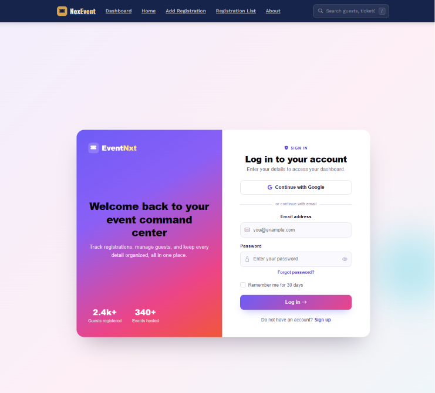
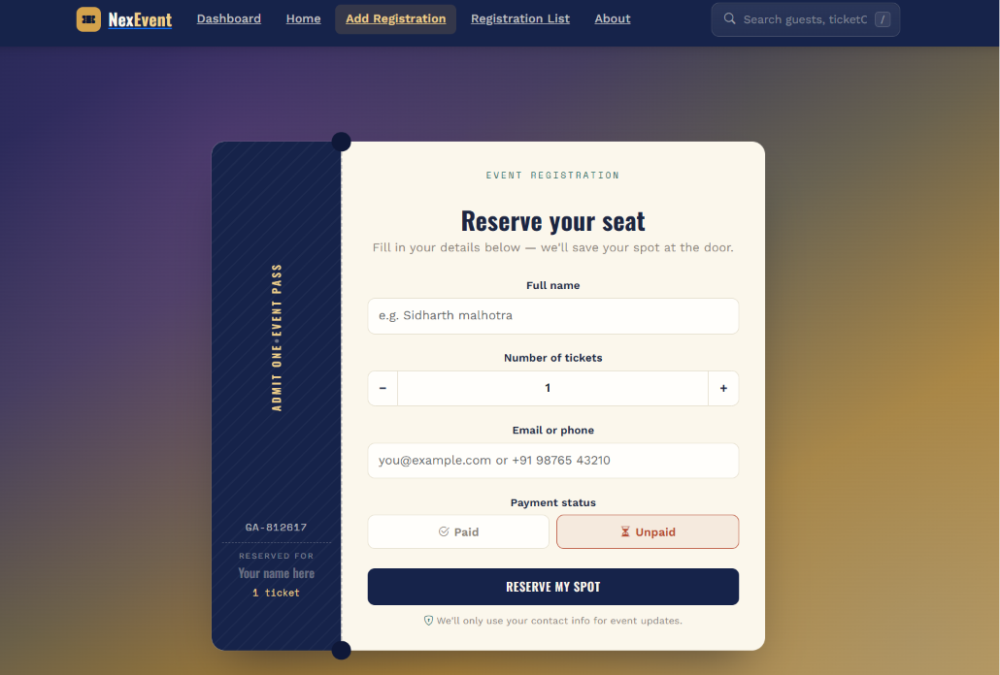
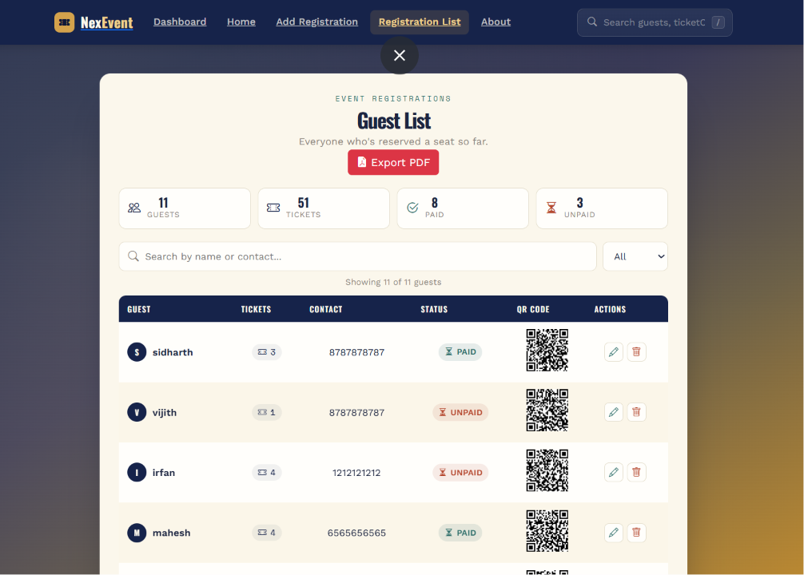
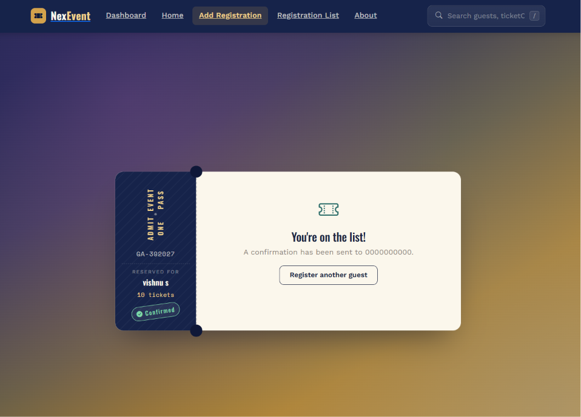
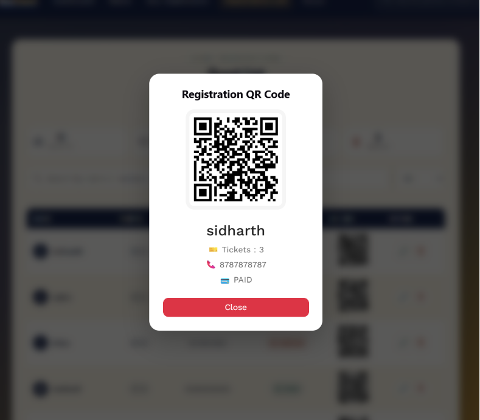
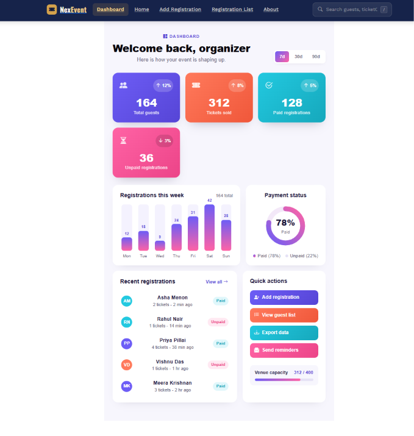

# 🎟️ Event Registration Management System

A Full Stack MERN Event Registration Management System developed during my MERN Stack Internship. This application helps organizers efficiently manage event registrations with authentication, QR code generation, PDF export, and CRUD operations.

---

## 🚀 Features

- 🔐 Admin Login Authentication
- ➕ Add New Registrations
- 📋 View All Registrations
- ✏️ Update Registration Details
- ❌ Delete Registrations
- 🔍 Search by Name or Contact
- 💳 Payment Status (Paid / Unpaid)
- 📱 QR Code Generation
- 📄 Export Registration List as PDF
- 📊 Dashboard Overview
- 📱 Responsive User Interface

---

## 🛠️ Tech Stack

### Frontend
- React.js
- React Router
- Bootstrap 5
- CSS3
- SweetAlert2
- jsPDF
- QRCode React

### Backend
- Node.js
- Express.js
- MongoDB
- Mongoose

---

## 📂 Project Structure

```
Event-registration-management-system
│
├── backend
│   ├── models
│   ├── routes
│   ├── database
│   ├── package.json
│   └── app.js
│
├── frontend
│   ├── src
│   ├── public
│   ├── package.json
│   └── vite.config.js
│
└── README.md
```

---

## ⚙️ Installation

### Clone Repository

```bash
git clone https://github.com/viishh0/Event-registration-management-system.git
```

### Backend Setup

```bash
cd backend
npm install
npm start
```

### Frontend Setup

```bash
cd frontend
npm install
npm run dev
```

---

## ✨ Modules

- Admin Authentication
- Dashboard
- Registration Form
- Registration List
- Search & Filter
- QR Code Generator
- PDF Report Export

---

## 📸 Screenshots

### 🏠 Home Page


### 🔐 Login Page


### 📝 Registration Page


### 📋 Registration List


### 🎫 Ticket Page


### 📱 QR Code Page


### 📊 Dashboard


### ℹ️ About Page


---

## 🎯 Future Improvements

- Email Notifications
- Event Creation Module
- Online Payment Gateway
- User Registration
- Attendance Scanner
- Analytics Dashboard

---

## 👨‍💻 Developed By

**Vishnu S**

Computer Science Engineering Student

College of Engineering Attingal

---

## 📜 License

This project is developed for educational and internship purposes.